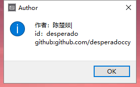
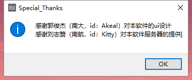
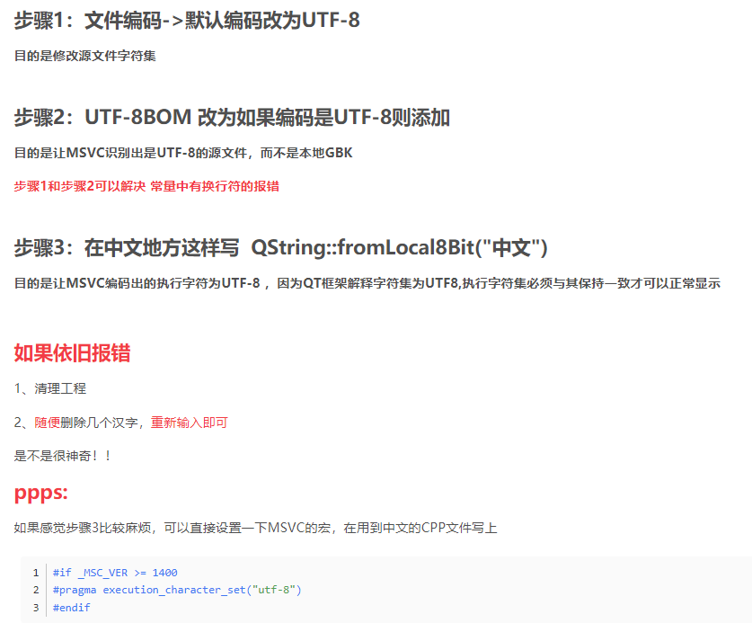

# 课设报告

## Read Me

### 图书管理系统使用简介

---
>前提注意


本软件数据库采用远程服务器，因此所有操作都是会对服务器产生影响的。本软件也对相应操作进行了sql攻击检测，如果您技术过硬，绕过了检测，并对服务器产生了不可逆转的毁坏，我们将对您进行问责，并索取相应赔偿金

---

>使用简介

#### 销售模块

本模块模拟了图书销售过程。

1.通过修改税率按钮可以更改当前销售税

2.通过购书按钮可以填写相应ISBN或图书名称以及购买量进行购买（书库列表可以通过报表模块的整个书库按钮进行查看）

3.通过收银按钮将结束本次购书过程，购书列表将清空，并返回主界面。

#### 图书管理模块

本模块可以对书库进行管理

1.查询 可以进行模糊查询找到符合关键字的所有书籍

2.添加 可以添加书库中没有的图书

3.修改 搜索指定图书并修改其中信息

4.删除 删除某个具体图书

#### 报表模块

本模块对书库信息进行列表

按钮界面说明已经很详细，通过相关关键词对书库图书进行排序列表

## 程序框架流程图


## 图书管理系统开发工程文档

>所用知识：c++类的使用、QT　UI设计、Mysql数据库

>软件特色：UI界面，数据库使用，sql注入过滤

>代码总量：1733 + 326 lines
### 0X00总体介绍

本软件采用QT5.12.1版本文本编辑器，MSVC2015 64bit编译器进行开发。文字编码为utf-8。

软件设计舍弃了复杂耗时落后的基础C++文件操作，选择使用可以实时同步数据的MYSQL数据库进行远程链接。

通过大量的connect函数将UI界面输入信号和相关函数进行链接

舍弃繁琐的槽函数设计，选用简洁方便的lambda函数代替槽函数，但一定程度上降低了代码可读性。

### 0X01UI设计

软件舍弃了简单不美观的控制台窗台，改为Windows桌面应用设计。界面UI使用一个整体mainwindowUI，里面嵌套三个功能模块QWidgetUI，使三个模块之间的切换更加方便。为了软件美观，没有使用QT中预设的类，而是应用继承对其进行UI美化。UI的美化我使用图片来美化按钮样式，其动态效果则使用下移上移来伪造3D效果。按钮整体风格由郭俊杰同学使用PS设计，在软件中我也对其进行了感谢。

### 0x02功能设计

将更改税率的按钮从图书管理模块转移到销售模块

每个功能所对应的功能框均使用QWidget或QTableWidget，然后向其中添加所需要的按键，标签。

### 0x03信号链接

使用connect函数链接信号，槽函数直接采用lambda函数。

### 0x04sql数据库的链接

由于QT5.12目前不支持8.0版本的MYSQL，所以需要在QT下安装MYSQL５.７　mysql.dll文件。

本软件使用服务器端的MYSQL数据库，所以不用担心数据的流失和异地使用软件没有书库的情况。

服务器由刘志赞同学提供，在软件中我也对其进行了感谢。


### 0x05sql数据库的使用

sql数据库的使用很简单，即是sql语句的使用。

但在使用的过程中，若是直接使用未经处理的用户输入值，则会产生不可估量的危害。本软件最大的危害就是sql注入。要预防sql注入，我们就认同一个观点，用户的任何输入都不可信，所以我在软件中对用户的每次输入都进行了处理，过滤了所有sql注入可能使用到的关键字。


## 开发QT桌面应用时遇到的问题

### 一、堆溢出的问题


百思不得其解，由于是堆溢出的问题，第一个想到的是堆空间没有及时释放，即析构函数没有写好。然后去请教了一下曹师傅，曹师傅说堆溢出的原因就两个，一个是内存分配，一个是缓冲区问题。由于缓冲区不太明白是什么东西，所以自作主张认定是内存分配问题了。但是千改忘改都没有用，偶然之下，我移除了原本的背景音乐文件，结果就能跑了。

=_=......


---
缓冲区问题：

### 二、中文问题

未解决


将“ ”中的中文改为英文就能跑了，原因未找到。

### 三、sql数据库的链接问题

这个问题让我困扰了10个小时，百度了无数种方法，下载了各种包，都没有起效。结果问题就是因为QT不支持sql8.0!!!所以当qmysql驱动不能加载时，我将mysql8.0的libmysql.dll文件复制到编译器 bin 下是无用的！！！

---

解决方法：下载mysql5.7版本，并移植动态链接库到qt中，即可运行驱动。

### 四、一个有趣小bug（中文）

编译器对中文的支持一直是让人头疼的问题，在开发过程中遇到每行最后一个汉字显示不出来的问题。





所以我只能把最后一个中文汉字转为中文|，这也就导致了这有两处非常突兀的竖线。

---
解决方案：将问题二和问题四结合起来思考，当我们在问题二里的字符串最后多敲一个空格，编译器不会报错，进而出现问题四（QAQ，无法复现bug）。如此一想，我们便可以想到中文编码的问题，中文在计算机中占两个字节，而程序出现了吞字现象，可能的原因只有编码冲突（Windows使用gbk，QT使用utf-8）。上网百度了一下方法。如图：


## 源码

### bookmanage.h

```c++
#ifndef BOOKMANAGE_H
#define BOOKMANAGE_H

#include <QWidget>

namespace Ui {
class BookManage;
}

class BookManage : public QWidget
{
    Q_OBJECT

public:
    explicit BookManage(QWidget *parent = nullptr);
    ~BookManage();
private:
    Ui::BookManage *ui;
};

#endif // BOOKMANAGE_H

```

### mainwindow.h
```C++
#ifndef MAINWINDOW_H
#define MAINWINDOW_H

#include "bookmanage.h"
#include "reportform.h"
#include "salesmode.h"
#include <QMainWindow>
namespace Ui {
class MainWindow;
}

class MainWindow : public QMainWindow
{
    Q_OBJECT

public:
    explicit MainWindow(QWidget *parent = nullptr);
    ~MainWindow();
    //背景绘制事件
    void paintEvent(QPaintEvent *);
    //销售模块ui
    SalesMode *saleMode;
    //图书管理模块ui
    BookManage *bookManage;
    //报表模块ui
    ReportForm *reportForm;
private:
    Ui::MainWindow *ui;
};

#endif // MAINWINDOW_H

```

### modebutton.h
```C++
#ifndef MODEBUTTON_H
#define MODEBUTTON_H

#include <QPushButton>
#include <QDebug>

class ModeButton : public QPushButton
{
    Q_OBJECT
public:
    //explicit ModeButton(QWidget *parent = nullptr);
    ModeButton(QString normalImg,QString pressImg = "");
    ~ModeButton();
    QString normalImgPath;
    QString pressImgPath;
    //动态跳跃up
    void Zoom1();
    //动态跳跃down
    void Zoom2();
signals:

public slots:
};

#endif // MODEBUTTON_H

```

### reportform.h
```c++
#ifndef REPORTFORM_H
#define REPORTFORM_H

#include <QWidget>

namespace Ui {
class ReportForm;
}

class ReportForm : public QWidget
{
    Q_OBJECT

public:
    explicit ReportForm(QWidget *parent = nullptr);
    ~ReportForm();

private:
    Ui::ReportForm *ui;
};

#endif // REPORTFORM_H

```
### salesmode.h
```c++
#ifndef SALESMODE_H
#define SALESMODE_H

#include <QWidget>
#include <QLabel>
#include <QTableWidget>

namespace Ui {
class SalesMode;
}

class SalesMode : public QWidget
{
    Q_OBJECT

public:
    explicit SalesMode(QWidget *parent = nullptr);
    ~SalesMode();
    double *cnt,*taxs,*pays;
    int *i;
    QLabel *salecnt;
    QLabel *saletax;
    QLabel *paycnt;
    QTableWidget *watchui;
private:
    Ui::SalesMode *ui;
};

#endif // SALESMODE_H
```

### main.cpp

```c++

#if _MSC_VER >= 1400
#pragma execution_character_set("utf-8")
#endif

#include "mainwindow.h"
#include <QApplication>
#include <QTextCodec>

int main(int argc, char *argv[])
{
    QApplication a(argc, argv);
    MainWindow w;
    w.show();
    return a.exec();
}

```

### mainwindow.cpp

```c++
#if _MSC_VER >= 1400
#pragma execution_character_set("utf-8")
#endif

#include "mainwindow.h"
#include "modebutton.h"
#include "ui_mainwindow.h"
#include <QToolButton>
#include <QPixmap>
#include <QMessageBox>
#include <QPainter>
#include <QTextCodec>
#include <QtCore>
#include <QSound>
#include <QSqlDatabase>
#include <QSqlQuery>

MainWindow::MainWindow(QWidget *parent) :
    QMainWindow(parent),
    ui(new Ui::MainWindow)
{
    ui->setupUi(this);


    //设置主窗口大小并固定
    this->setFixedSize(1024,768);
    //设置标题
    this->setWindowTitle("图书管理系统");
    //设置应用图片
    this->setWindowIcon(QIcon(":/image/icon.png"));

    //链接数据库
    //使用sql odbc插件
    QSqlDatabase db = QSqlDatabase::addDatabase("QMYSQL");
    //远程连接
    db.setHostName("106.15.177.94");
    db.setPort(3306);
    db.setDatabaseName("desperado");
    db.setUserName("desperado");
    db.setPassword("ccy13003563808");

    if(db.open()==false){
        QMessageBox::critical(this,"warning","it cannot open datebase \nPlease check the network connection");
    }


    //区分模块按钮和主界面的分割线
    QFrame *line_1 = new QFrame(this);
    line_1->setGeometry(QRect(40,123,944,3));
    line_1->setFrameShape(QFrame::HLine);
    line_1->setFrameShadow(QFrame::Sunken);
    line_1->raise();

    //菜单栏
    //about菜单设置
    //Author设置
    connect(ui->actionauthor,&QAction::triggered,[=](){
        QString message="作者：陈楚燚 \nid：desperado \ngithub:github.com/desperadoccy \n ";
        QMessageBox::information(this,"Author",message);
    });
    //Special_Thanks设置
    connect(ui->action_Special_Thanks,&QAction::triggered,[=](){
        QString message="感谢郭俊杰（南大，id：Akeal）对本软件的ui设计 \n感谢刘志赞（南航，id：Kitty）对本软件服务器的提供 \n";
        QMessageBox::information(this,"Special_Thanks",message);
    });
    //Reference_material设置
    connect(ui->actionReference_material,&QAction::triggered,[=](){
        QString message="参考资料：黑马qt视频教程 \n网址：https://www.bilibili.com/video/av41374178";
        QMessageBox::information(this,"Special_Thanks",message);
    });
    //help菜单设置
    //帮助设置
    connect(ui->actionhow,&QAction::triggered,[=](){
       QMessageBox::information(this,"help","具体操作请查看帮助文档");
    });


    //销售模块ui
    saleMode = new SalesMode(this);
    saleMode->setFixedSize(900,575);
    saleMode->move(65,115);
    //默认隐藏ui界面
    saleMode->hide();
    //销售模块按钮
    ModeButton *button_1 = new ModeButton(":/image/button1.png");
    button_1->setParent(this);
    button_1->move(185,38);
    connect(button_1,&ModeButton::clicked,[=](){
        //按钮弹跳效果
        button_1->Zoom1();
        button_1->Zoom2();
        //显示销售模块ui,隐藏其他ui
        saleMode->show();
        bookManage->hide();
        reportForm->hide();
    });


    //图书管理ui
    bookManage = new BookManage(this);
    bookManage->setFixedSize(900,575);
    bookManage->move(65,115);
    //默认隐藏ui界面
    bookManage->hide();
    //图书管理按钮
    ModeButton *button_2 = new ModeButton(":/image/button2.png");
    button_2->setParent(this);
    button_2->move(435,38);
    connect(button_2,&ModeButton::clicked,[=](){
        //按钮弹跳效果
        button_2->Zoom1();
        button_2->Zoom2();
        //显示图书管理ui,隐藏其他ui
        bookManage->show();
        saleMode->hide();
        reportForm->hide();
        double *a,*b,*c;
        int *d;
        a=saleMode->taxs;
        b=saleMode->pays;
        c=saleMode->cnt;
        d=saleMode->i;
        *a=0;
        *b=0;
        *c=0;
        *d=0;
        saleMode->watchui->clear();
        saleMode->watchui->setRowCount(0);
        saleMode->salecnt->setText(QString("销售合计: RMB %1").arg("0"));
        saleMode->saletax->setText(QString("零售税: RMB %1").arg("0"));
        saleMode->paycnt->setText(QString("应付金额: RMB %1").arg("0"));
    });


    //报表模块ui
    reportForm = new ReportForm(this);
    reportForm->setFixedSize(900,575);
    reportForm->move(65,115);
    //默认隐藏ui界面
    reportForm->hide();
    //报表模块按钮
    ModeButton *button_3 = new ModeButton(":/image/button3.png");
    button_3->setParent(this);
    button_3->move(685,38);
    connect(button_3,&ModeButton::clicked,[=](){
        //按钮弹跳效果
        button_3->Zoom1();
        button_3->Zoom2();
        //显示报表模块ui,隐藏其他ui
        reportForm->show();
        bookManage->hide();
        saleMode->hide();
        double *a,*b,*c;
        int *d;
        a=saleMode->taxs;
        b=saleMode->pays;
        c=saleMode->cnt;
        d=saleMode->i;
        *a=0;
        *b=0;
        *c=0;
        *d=0;
        saleMode->watchui->clear();
        saleMode->watchui->setRowCount(0);
        saleMode->salecnt->setText(QString("销售合计: RMB %1").arg("0"));
        saleMode->saletax->setText(QString("零售税: RMB %1").arg("0"));
        saleMode->paycnt->setText(QString("应付金额: RMB %1").arg("0"));
    });

    //时间显示的实现
    //启用计时器 1s更新1次
    QTimer *timer = new QTimer(this);
    timer->start(1000);
    connect(timer,&QTimer::timeout,[=](){
        QDateTime time = QDateTime::currentDateTime();
        QString timeStr = time.toString("yyyy-MM-dd hh:mm:ss");
        ui->time_label->setText(timeStr);
    });


//    缓冲区无法存放大型音频，舍去
//    //循环播放
//    QSound *backgourndSound = new QSound(":/music/background.mp3",this);
//    backgourndSound->setLoops(QSound::Infinite);
//    //音乐播放按钮的实现
//    backgourndSound->play();
//    connect(ui->checkBox,&QCheckBox::click,[=](){
//        if( ui->checkBox->isChecked()==true)
//            backgourndSound->play();
//        else {
//            backgourndSound->stop();
//        }
//    });


    //退出按钮功能实现
    connect(ui->endButton,&QToolButton::clicked,[=](){
        //弹出对话框判断确定是否退出
        if(QMessageBox::Yes == QMessageBox::question(this,"确认","确定退出吗?",QMessageBox::Yes | QMessageBox::No,QMessageBox::No))
        {
            //db.removeDatabase("desperado");
            this->close();
        }
    });

}

MainWindow::~MainWindow()
{
    delete ui;
}

void MainWindow::paintEvent(QPaintEvent *)
{
    //背景
    QPainter painter(this);
    QPixmap pix(":/image/bgd.jpg");
    painter.drawPixmap(0,0,1024,768,pix);
    //logo显示
    QPainter painter_logo(this);
    painter_logo.drawPixmap(20,708,QPixmap(":/image/logo.png"));

}

```
### bookmanage.cpp
```c++
#if _MSC_VER >= 1400
#pragma execution_character_set("utf-8")
#endif

#include "bookmanage.h"
#include "ui_bookmanage.h"
#include "modebutton.h"
#include <QPushButton>
#include <QTimer>
#include <QSqlDatabase>
#include <QSqlQuery>
#include <QMessageBox>
#include <QFrame>
#include <QLabel>
#include <QFont>
#include <QLineEdit>
#include <QVBoxLayout>
#include <QTableView>
#include <QStandardItem>
#include <QTableWidget>
#include <QSqlRecord>
#include <QDateEdit>

BookManage::BookManage(QWidget *parent) :
    QWidget(parent),
    ui(new Ui::BookManage)
{
    ui->setupUi(this);

    //区分功能按钮和显示区域的分割线
    QFrame *line_v1 = new QFrame(this);
    line_v1->setGeometry(QRect(125,60,3,430));
    line_v1->setFrameShape(QFrame::VLine);
    line_v1->setFrameShadow(QFrame::Sunken);
    line_v1->raise();

    //字体设置
    QFont fonttitle;
    fonttitle.setPointSize(16);
    fonttitle.setBold(true);
    QFont fonttext;
    fonttext.setPointSize(12);

    //返回键的ui设置
    ModeButton *back_button = new ModeButton(":/image/backbutton.png");
    back_button->setParent(this);
    back_button->move(756,515);
    //按钮功能实现
    connect(back_button,&QPushButton::clicked,[=](){
        back_button->Zoom1();
        back_button->Zoom2();
        //利用延迟显示弹跳
        QTimer::singleShot(500,this,[=](){
            this->hide();
        });

    });

    //功能ui初始化
    //查找
    //查找框ui
    QWidget *queryui = new QWidget(this);
    queryui->setFixedSize(746,430);
    queryui->move(150,60);
    queryui->hide();
    QLabel *title = new QLabel(queryui);
    title->setText("查询模块（至少填写一个查询信息）");
    QLabel *bookname = new QLabel(queryui);
    bookname->setText("图书名称:");
    QLabel *bookisbn = new QLabel(queryui);
    bookisbn->setText("isbn:");
    QLabel *bookauthor = new QLabel(queryui);
    bookauthor->setText("作者：");
    QLabel *bookpress = new QLabel(queryui);
    bookpress->setText("出版社：");
    QPushButton *btnquery = new QPushButton(queryui);
    btnquery->setText("查询");
    QLineEdit *booktext = new QLineEdit(queryui);
    QLineEdit *isbntext = new QLineEdit(queryui);
    QLineEdit *authortext = new QLineEdit(queryui);
    QLineEdit *presstext = new QLineEdit(queryui);
    title->setFont(fonttitle);
    bookauthor->setStyleSheet("color:white");
    bookpress->setStyleSheet("color:white");
    bookname->setStyleSheet("color:white");
    bookisbn->setStyleSheet("color:white");
    bookname->setFont(fonttext);
    bookisbn->setFont(fonttext);
    bookpress->setFont(fonttext);
    bookauthor->setFont(fonttext);
    booktext->move(350,100);
    isbntext->move(350,280);
    authortext->move(350,160);
    presstext->move(350,220);
    title->move(155,20);
    bookname->move(190,100);
    bookauthor->move(190,160);
    bookpress->move(190,220);
    bookisbn->move(190,280);
    btnquery->move(470,350);
    //返回框ui
    QTableWidget *response = new QTableWidget(this);
    response->setFixedSize(740,400);
    response->move(175,60);
    response->setColumnCount(8);
    response->setHorizontalHeaderLabels(QStringList() << "ISBN"<< "书名"<< "作者"<< "出版社"<< "进书日期"<< "库存量"<< "批发价"<<"零售价");
    response->hide();
    //返回键的ui重置
    ModeButton *back_button2 = new ModeButton(":/image/backbutton.png");
    back_button2->setParent(this);
    back_button2->move(756,515);
    back_button2->hide();
    //按钮功能实现
    connect(back_button2,&QPushButton::clicked,[=](){
        back_button2->Zoom1();
        back_button2->Zoom2();
        //利用延迟显示弹跳
        QTimer::singleShot(500,this,[=](){
            response->hide();
            back_button2->hide();
            back_button->show();
        });

    });
    //查询实现
    connect(btnquery,&QPushButton::clicked,[=](){
        QString a;
        //sql注入过滤
        if(booktext->text().contains("' ")||booktext->text().contains("#")||booktext->text().contains(" -- ")||isbntext->text().contains("'")||isbntext->text().contains("#")||isbntext->text().contains(" -- "))
            if(presstext->text().contains("' ")||presstext->text().contains("#")||presstext->text().contains(" -- ")||authortext->text().contains("' ")||authortext->text().contains("#")||authortext->text().contains(" -- "))
        {
            QMessageBox::critical(this,"hack attacked","检测到可能的sql注入攻击，请停止！后果自负！");
            return;
        }
        //查询
        if(booktext->text()=="")
        {
            if(authortext->text()=="")
            {
                if(presstext->text()=="")
                {
                    if(isbntext->text()=="")
                    {
                        QMessageBox::critical(this,"error","请输入查询内容！");
                        return;
                    }
                    else {
                        a = QString("select * from Book where isbn like '%%1%'").arg(isbntext->text());
                    }
                }
                else {
                    if(isbntext->text()=="")
                    {
                        a = QString("select * from Book where press like '%%1%'").arg(presstext->text());
                    }
                    else {
                        a = QString("select * from Book where isbn like '%%1%' and press like '%%2%'").arg(isbntext->text()).arg(presstext->text());
                    }
                }
            }
            else{
                if(presstext->text()=="")
                {
                    if(isbntext->text()=="")
                    {
                        a = QString("select * from Book where author like '%%1%'").arg(authortext->text());
                    }
                    else {
                        a = QString("select * from Book where isbn like '%%1%' and author like '%%2%'").arg(isbntext->text()).arg(authortext->text());
                    }
                }
                else {
                    if(isbntext->text()=="")
                    {
                        a = QString("select * from Book where press like '%%1%' and author like '%%2%'").arg(presstext->text()).arg(authortext->text());
                    }
                    else {
                        a = QString("select * from Book where isbn like '%%1%' and press like '%%2%' and author like '%%3%'").arg(isbntext->text()).arg(presstext->text()).arg(authortext->text());
                    }
                }
            }
        }
        else {
            if(authortext->text()=="")
            {
                if(presstext->text()=="")
                {
                    if(isbntext->text()=="")
                    {
                        a = QString("select * from Book where name like '%%1%'").arg(booktext->text());
                    }
                    else {
                        a = QString("select * from Book where name like '%%1%' and isbn like '%%2%'").arg(booktext->text()).arg(isbntext->text());
                    }
                }
                else {
                    if(isbntext->text()=="")
                    {
                         a = QString("select * from Book where name like '%%1%' and press like '%%2%' ").arg(booktext->text()).arg(presstext->text());
                    }
                    else {
                         a = QString("select * from Book where name like '%%1%' and isbn like '%%2%' and press like '%%3%'").arg(booktext->text()).arg(isbntext->text()).arg(presstext->text());
                    }
                }
            }
            else{
                if(presstext->text()=="")
                {
                    if(isbntext->text()=="")
                    {
                         a = QString("select * from Book where name like '%%1%' and author like '%%2%'").arg(booktext->text()).arg(authortext->text());
                    }
                    else {
                         a = QString("select * from Book where name like '%%1%' and isbn like '%%2%' and author like '%%3%'").arg(booktext->text()).arg(isbntext->text()).arg(authortext->text());
                    }
                }
                else {
                    if(isbntext->text()=="")
                    {
                         a = QString("select * from Book where name like '%%1%' and press like '%%2%' and author like '%%3%'").arg(booktext->text()).arg(presstext->text()).arg(authortext->text());
                    }
                    else {
                        a = QString("select * from Book where isbn like '%%1%' and press like '%%2%' and author like '%%3%'").arg(isbntext->text()).arg(presstext->text()).arg(authortext->text());
                    }
                }
            }

        }
        QSqlQuery sqlquery;
        sqlquery.exec(a);
        int i=0;
        if(!sqlquery.next())
        {
            QMessageBox::information(this,"error","未找到指定图书");
            return;
        }
        sqlquery.previous();
        while(sqlquery.next())
        {
           response->setRowCount(i+1);
           response->setItem(i,0,new QTableWidgetItem(sqlquery.value(2).toString()));
           response->setItem(i,1,new QTableWidgetItem(sqlquery.value(1).toString()));
           response->setItem(i,2,new QTableWidgetItem(sqlquery.value(3).toString()));
           response->setItem(i,3,new QTableWidgetItem(sqlquery.value(4).toString()));
           response->setItem(i,4,new QTableWidgetItem(sqlquery.value(5).toString()));
           response->setItem(i,5,new QTableWidgetItem(sqlquery.value(6).toString()));
           response->setItem(i,6,new QTableWidgetItem(sqlquery.value(7).toString()));
           response->setItem(i,7,new QTableWidgetItem(sqlquery.value(8).toString()));
           i++;    
        }
        response->show();
        back_button->hide();
        back_button2->show();
    });

    //添加
    //添加框ui
    QWidget *insertui = new QWidget(this);
    insertui->setFixedSize(756,430);
    insertui->move(150,60);
    insertui->hide();
    QLabel *title1 = new QLabel(insertui);
    title1->setText("添加模块");
    QLabel *bookname1 = new QLabel(insertui);
    bookname1->setText("图书名称:");
    QLabel *bookisbn1 = new QLabel(insertui);
    bookisbn1->setText("isbn:");
    QLabel *bookauthor1 = new QLabel(insertui);
    bookauthor1->setText("作者:");
    QLabel *bookpress1 = new QLabel(insertui);
    bookpress1->setText("出版社:");
    QLabel *bookdate1 = new QLabel(insertui);
    bookdate1->setText("入库时间:");
    QLabel *bookstock1 = new QLabel(insertui);
    bookstock1->setText("库存量:");
    QLabel *bookprice11 = new QLabel(insertui);
    bookprice11->setText("批发价:");
    QLabel *bookprice21 = new QLabel(insertui);
    bookprice21->setText("零售价:");
    QPushButton *btninsert = new QPushButton(insertui);
    btninsert->setText("添加");
    QLineEdit *name1text = new QLineEdit(insertui);
    QLineEdit *isbn1text = new QLineEdit(insertui);
    QLineEdit *author1text = new QLineEdit(insertui);
    QLineEdit *press1text = new QLineEdit(insertui);
    QDateEdit *date1text = new QDateEdit(insertui);
    date1text->setCalendarPopup(true);
    QLineEdit *stock1text = new QLineEdit(insertui);
    QLineEdit *price11text = new QLineEdit(insertui);
    QLineEdit *price21text = new QLineEdit(insertui);
    title1->setFont(fonttitle);
    bookname1->setStyleSheet("color:white");
    bookisbn1->setStyleSheet("color:white");
    bookauthor1->setStyleSheet("color:white");
    bookpress1->setStyleSheet("color:white");
    bookdate1->setStyleSheet("color:white");
    bookstock1->setStyleSheet("color:white");
    bookprice11->setStyleSheet("color:white");
    bookprice21->setStyleSheet("color:white");
    bookname1->setFont(fonttext);
    bookisbn1->setFont(fonttext);
    bookauthor1->setFont(fonttext);
    bookpress1->setFont(fonttext);
    bookdate1->setFont(fonttext);
    bookstock1->setFont(fonttext);
    bookprice11->setFont(fonttext);
    bookprice21->setFont(fonttext);
    name1text->move(350,70);
    isbn1text->move(350,100);
    author1text->move(350,130);
    press1text->move(350,160);
    date1text->move(350,190);
    stock1text->move(350,220);
    price11text->move(350,250);
    price21text->move(350,280);
    title1->move(285,0);
    bookname1->move(190,70);
    bookisbn1->move(190,100);
    bookauthor1->move(190,130);
    bookpress1->move(190,160);
    bookdate1->move(190,190);
    bookstock1->move(190,220);
    bookprice11->move(190,250);
    bookprice21->move(190,280);
    btninsert->move(470,350);
    //添加实现
    connect(btninsert,&QPushButton::clicked,[=](){
        QString a;
        //sql注入过滤
        if(name1text->text().contains("' ")||name1text->text().contains("#")||name1text->text().contains(" -- ")||isbn1text->text().contains("'")||isbn1text->text().contains("#")||isbn1text->text().contains(" -- ")||author1text->text().contains("'")||author1text->text().contains("#")||author1text->text().contains(" -- "))
            if(press1text->text().contains("' ")||press1text->text().contains("#")||press1text->text().contains(" -- ")||date1text->text().contains("' ")||date1text->text().contains("#")||date1text->text().contains(" -- ")||stock1text->text().contains("' ")||stock1text->text().contains("#")||stock1text->text().contains(" -- "))
                if(price11text->text().contains("' ")||price11text->text().contains("#")||price11text->text().contains(" -- ")||price21text->text().contains("' ")||price21text->text().contains("#")||price21text->text().contains(" -- "))
                {
                    QMessageBox::critical(this,"hack attacked","检测到可能的sql注入攻击，请停止！后果自负！");
                    return;
                }
        //一些输入判断
        if(name1text->text()==""||isbn1text->text()==""||stock1text->text()==""||price11text->text()==""||price21text->text()=="")
        {
            QMessageBox::critical(this,"错误","书名，ISBN，库存，批发价，销售价请勿为空！");
            return;
        }
        if(price11text->text().toDouble()<0||price21text->text().toDouble()<0||stock1text->text().toInt()<0)
        {
            QMessageBox::critical(this,"错误","价格或库存量不能为负");
            return;
        }
        if(price11text->text().toDouble()>price21text->text().toDouble())
        {
            QMessageBox::critical(this,"错误","批发价不能小于零售价");
            return;
        }
        if(isbn1text->text().toULongLong()==0)
        {
            QMessageBox::critical(this,"错误","isbn填写出错");
            return;
        }
        QString d=date1text->text();
        for(int i=0;i<d.length();i++)
        {
            if(d[i]=="/")
                d.replace(i,1,"-");
        }
        //判断是否已有此图书，即ISBN是否相同
        QString b;
        b = QString("select * from Book where isbn = '%1' or name = '%2'").arg(isbn1text->text()).arg(name1text->text());
        QSqlQuery temp;
        temp.exec(b);
        if(temp.next())
        {
            QMessageBox::critical(this,"错误","已有此图书");
            return;
        }
        //执行sql
        a = QString("insert into Book values(0,'%1','%2','%3','%4','%5',%6,%7,%8,%9)").arg(name1text->text()).arg(isbn1text->text()).arg(author1text->text()).arg(press1text->text()).arg(d).arg(stock1text->text()).arg(price11text->text()).arg(price21text->text()).arg(price11text->text().toDouble()*stock1text->text().toInt());
        QSqlQuery sqlquery;
        if(sqlquery.exec(a))
        {
            QMessageBox::information(this,"成功","添加成功！");
        }
        else{
            QMessageBox::information(this,"失败","添加失败！");
        }

    });


    //修改
    //修改框ui
    QWidget *updateui = new QWidget(this);
    updateui->setFixedSize(756,430);
    updateui->move(150,60);
    updateui->hide();
    QLabel *title3 = new QLabel(updateui);
    title3->setText("修改模块（至少填写一个修改信息） \n     查找你要修改的图书信息");
    QLabel *bookname3 = new QLabel(updateui);
    bookname3->setText("图书名称:");
    QLabel *bookisbn3 = new QLabel(updateui);
    bookisbn3->setText("isbn:");
    QPushButton *btnupdate1 = new QPushButton(updateui);
    btnupdate1->setText("查询");
    QLineEdit *nametext3 = new QLineEdit(updateui);
    QLineEdit *isbntext3 = new QLineEdit(updateui);
    title3->setFont(fonttitle);
    bookname3->setStyleSheet("color:white");
    bookisbn3->setStyleSheet("color:white");
    bookname3->setFont(fonttext);
    bookisbn3->setFont(fonttext);
    nametext3->move(350,170);
    isbntext3->move(350,270);
    title3->move(155,90);
    bookname3->move(190,170);
    bookisbn3->move(190,270);
    btnupdate1->move(470,350);
    //返回框ui
    QWidget *response2 = new QWidget(this);
    response2->setFixedSize(756,430);
    response2->move(150,60);
    response2->hide();
    QLabel *title4 = new QLabel(response2);
    title4->setText("修改模块");
    QLabel *bookname4 = new QLabel(response2);
    bookname4->setText("图书名称:");
    QLabel *bookisbn4 = new QLabel(response2);
    bookisbn4->setText("isbn:");
    QLabel *bookauthor4 = new QLabel(response2);
    bookauthor4->setText("作者:");
    QLabel *bookpress4 = new QLabel(response2);
    bookpress4->setText("出版社:");
    QLabel *bookdate4 = new QLabel(response2);
    bookdate4->setText("入库时间:");
    QLabel *bookstock4 = new QLabel(response2);
    bookstock4->setText("库存量:");
    QLabel *bookprice14 = new QLabel(response2);
    bookprice14->setText("批发价:");
    QLabel *bookprice24 = new QLabel(response2);
    bookprice24->setText("零售价:");
    QPushButton *btnupdate2 = new QPushButton(response2);
    btnupdate2->setText("修改");
    QLineEdit *booktext4 = new QLineEdit(response2);
    QLineEdit *isbntext4 = new QLineEdit(response2);
    QLineEdit *authortext4 = new QLineEdit(response2);
    QLineEdit *presstext4 = new QLineEdit(response2);
    QDateEdit *datetext4 = new QDateEdit(response2);
    datetext4->setCalendarPopup(true);
    QLineEdit *stocktext4 = new QLineEdit(response2);
    QLineEdit *price1text4 = new QLineEdit(response2);
    QLineEdit *price2text4 = new QLineEdit(response2);
    title4->setFont(fonttitle);
    bookname4->setStyleSheet("color:white");
    bookisbn4->setStyleSheet("color:white");
    bookauthor4->setStyleSheet("color:white");
    bookpress4->setStyleSheet("color:white");
    bookdate4->setStyleSheet("color:white");
    bookstock4->setStyleSheet("color:white");
    bookprice14->setStyleSheet("color:white");
    bookprice24->setStyleSheet("color:white");
    bookname4->setFont(fonttext);
    bookisbn4->setFont(fonttext);
    bookauthor4->setFont(fonttext);
    bookpress4->setFont(fonttext);
    bookdate4->setFont(fonttext);
    bookstock4->setFont(fonttext);
    bookprice14->setFont(fonttext);
    bookprice24->setFont(fonttext);
    booktext4->move(350,70);
    isbntext4->move(350,100);
    authortext4->move(350,130);
    presstext4->move(350,160);
    datetext4->move(350,190);
    stocktext4->move(350,220);
    price1text4->move(350,250);
    price2text4->move(350,280);
    title4->move(285,0);
    bookname4->move(190,70);
    bookisbn4->move(190,100);
    bookauthor4->move(190,130);
    bookpress4->move(190,160);
    bookdate4->move(190,190);
    bookstock4->move(190,220);
    bookprice14->move(190,250);
    bookprice24->move(190,280);
    btnupdate2->move(470,350);
    response2->hide();

    //返回键的ui重置
    ModeButton *back_button3 = new ModeButton(":/image/backbutton.png");
    back_button3->setParent(this);
    back_button3->move(756,515);
    back_button3->hide();
    //按钮功能实现
    connect(back_button3,&QPushButton::clicked,[=](){
        back_button3->Zoom1();
        back_button3->Zoom2();
        //利用延迟显示弹跳
        QTimer::singleShot(500,this,[=](){
            response2->hide();
            updateui->show();
            back_button3->hide();
            back_button->show();
        });

    });
    //修改实现
    //第一步查找修改图书
    connect(btnupdate1,&QPushButton::clicked,[=](){
        QString a;
        //sql注入过滤
        if(nametext3->text().contains("' ")||nametext3->text().contains("#")||nametext3->text().contains(" -- ")||isbntext3->text().contains("'")||isbntext3->text().contains("#")||isbntext3->text().contains(" -- "))
        {
            QMessageBox::critical(this,"hack attacked","检测到可能的sql注入攻击，请停止！后果自负！");
            return;
        }
        //查询
        if(nametext3->text()=="")
        {
            if(isbntext3->text()=="")
            {
                QMessageBox::critical(this,"error","请输入查询内容！");
                return;
            }
            else{
                a = QString("select * from Book where isbn = '%1'").arg(isbntext3->text());
            }
        }
        else {
            if(isbntext3->text()=="")
            {
                a = QString("select * from Book where name = '%1'").arg(nametext3->text());

            }
            else {
               a = QString("select * from Book where name = '%1' and isbn = '%2'").arg(nametext3->text()).arg(isbntext3->text());
            }
        }
        QSqlQuery sqlquery;
        sqlquery.exec(a);
        if(!sqlquery.next())
        {
            QMessageBox::information(this,"error","未找到指定图书");
            return;
        }
        else{
            booktext4->setText(sqlquery.value(1).toString());
            isbntext4->setText(sqlquery.value(2).toString());
            authortext4->setText(sqlquery.value(3).toString());
            presstext4->setText(sqlquery.value(4).toString());
            datetext4->setDate(sqlquery.value(5).toDate());
            stocktext4->setText(sqlquery.value(6).toString());
            price1text4->setText(sqlquery.value(7).toString());
            price2text4->setText(sqlquery.value(8).toString());
            updateui->hide();
            response2->show();
            back_button3->show();
        }
    });
    //第二步修改操作
    connect(btnupdate2,&QPushButton::clicked,[=](){
        if(QMessageBox::Yes == QMessageBox::question(this,"确认","确定修改吗?",QMessageBox::Yes | QMessageBox::No,QMessageBox::No))
        {
            QString a;
            //sql注入过滤
            if(booktext4->text().contains("' ")||booktext4->text().contains("#")||booktext4->text().contains(" -- ")||isbntext4->text().contains("'")||isbntext4->text().contains("#")||isbntext4->text().contains(" -- ")||authortext4->text().contains("'")||authortext4->text().contains("#")||authortext4->text().contains(" -- "))
                if(presstext4->text().contains("' ")||presstext4->text().contains("#")||presstext4->text().contains(" -- ")||datetext4->text().contains("' ")||datetext4->text().contains("#")||datetext4->text().contains(" -- ")||stocktext4->text().contains("' ")||stocktext4->text().contains("#")||stocktext4->text().contains(" -- "))
                    if(price1text4->text().contains("' ")||price1text4->text().contains("#")||price1text4->text().contains(" -- ")||price2text4->text().contains("' ")||price2text4->text().contains("#")||price2text4->text().contains(" -- "))
                    {
                        QMessageBox::critical(this,"hack attacked","检测到可能的sql注入攻击，请停止！后果自负！");
                        return;
                    }
            //一些输入判断
            if(booktext4->text()==""||isbntext4->text()==""||stocktext4->text()==""||price1text4->text()==""||price2text4->text()=="")
            {
                QMessageBox::critical(this,"错误","书名，ISBN，库存，批发价，销售价请勿为空！");
                return;
            }
            if(price1text4->text().toDouble()<0||price2text4->text().toDouble()<0||stocktext4->text().toInt()<0)
            {
                QMessageBox::critical(this,"错误","价格或库存量不能为负");
                return;
            }
            if(price1text4->text().toDouble()>price2text4->text().toDouble())
            {
                QMessageBox::critical(this,"错误","批发价不能小于零售价");
                return;
            }
            if(isbntext4->text().toULongLong()==0)
            {
                QMessageBox::critical(this,"错误","isbn填写出错");
                return;
            }
            QString d=datetext4->text();
            for(int i=0;i<d.length();i++)
            {
                if(d[i]=="/")
                    d.replace(i,1,"-");
            }
            //执行sql
            if(nametext3->text()=="")
            {
                if(isbntext3->text()=="")
                {
                    QMessageBox::critical(this,"error","请输入查询内容！");
                    return;
                }
                else{
                    a = QString("update Book set name = '%2',isbn = '%3',author = '%4',press = '%5',date = '%6',stock = '%7',price_1 = '%8',price_2 = '%9',price_1cnt = '%10' where isbn = '%1'").arg(isbntext3->text()).arg(booktext4->text()).arg(isbntext4->text()).arg(authortext4->text()).arg(presstext4->text()).arg(d).arg(stocktext4->text()).arg(price1text4->text()).arg(price2text4->text()).arg(price1text4->text().toDouble()*stocktext4->text().toInt());
                }
            }
            else {
                if(isbntext3->text()=="")
                {
                    a = QString("update Book set name = '%2',isbn = '%3',author = '%4',press = '%5',date = '%6',stock = '%7',price_1 = '%8',price_2 = '%9',price_1cnt = '%10' where name = '%1'").arg(nametext3->text()).arg(booktext4->text()).arg(isbntext4->text()).arg(authortext4->text()).arg(presstext4->text()).arg(d).arg(stocktext4->text()).arg(price1text4->text()).arg(price2text4->text()).arg(price1text4->text().toDouble()*stocktext4->text().toInt());

                }
                else {
                   a = QString("update Book set name = '%3',isbn = '%4',author = '%5',press = '%6',date = '%7',stock = '%8',price_1 = '%9',price_2 = '%10',price_1cnt = %11 where name = '%1' and isbn = '%2'").arg(nametext3->text()).arg(isbntext3->text()).arg(booktext4->text()).arg(isbntext4->text()).arg(authortext4->text()).arg(presstext4->text()).arg(d).arg(stocktext4->text()).arg(price1text4->text()).arg(price2text4->text()).arg(price1text4->text().toDouble()*stocktext4->text().toInt());
                }
            }
            QSqlQuery sqlquery;
            if(sqlquery.exec(a))
            {
                QMessageBox::information(this,"成功","修改成功！");
            }
            else{
                QMessageBox::information(this,"失败","修改失败！");
            }
        }
    });

    //删除
    //删除框ui
    QWidget *deleteui = new QWidget(this);
    deleteui->setFixedSize(756,430);
    deleteui->move(150,60);
    deleteui->hide();
    QLabel *title2 = new QLabel(deleteui);
    title2->setText("删除模块（至少填写一个删除信息）");
    QLabel *bookname2 = new QLabel(deleteui);
    bookname2->setText("图书名称:");
    QLabel *bookisbn2 = new QLabel(deleteui);
    bookisbn2->setText("isbn:");
    QPushButton *btndelete = new QPushButton(deleteui);
    btndelete->setText("删除");
    QLineEdit *nametext2 = new QLineEdit(deleteui);
    QLineEdit *isbntext2 = new QLineEdit(deleteui);
    title2->setFont(fonttitle);
    bookname2->setStyleSheet("color:white");
    bookisbn2->setStyleSheet("color:white");
    bookname2->setFont(fonttext);
    bookisbn2->setFont(fonttext);
    nametext2->move(350,170);
    isbntext2->move(350,270);
    title2->move(155,90);
    bookname2->move(190,170);
    bookisbn2->move(190,270);
    btndelete->move(470,350);
    //删除实现
    connect(btndelete,&QPushButton::clicked,[=](){
        if(QMessageBox::Yes == QMessageBox::question(this,"确认","确定删除吗?",QMessageBox::Yes | QMessageBox::No,QMessageBox::No))
        {
            QString a;
            //sql注入过滤
            if(nametext2->text().contains("' ")||nametext2->text().contains("#")||nametext2->text().contains(" -- ")||isbntext2->text().contains("'")||isbntext2->text().contains("#")||isbntext2->text().contains(" -- "))
            {
                QMessageBox::critical(this,"hack attacked","检测到可能的sql注入攻击，请停止！后果自负！");
                return;
            }
            //删除
            if(nametext2->text()=="")
            {
                if(isbntext2->text()=="")
                {
                    QMessageBox::critical(this,"error","请输入删除内容！");
                    return;
                }
                else{
                    a = QString("delete from Book where isbn = '%1'").arg(isbntext2->text());
                }
            }
            else {
                if(isbntext2->text()=="")
                {
                    a = QString("delete from Book where name = '%1'").arg(nametext2->text());

                }
                else {
                    a = QString("delete from Book where name = '%1' and isbn = '%2'").arg(nametext2->text()).arg(isbntext2->text());
                }
            }
            QSqlQuery sqlquery;
            if(sqlquery.exec(a))
            {
                QMessageBox::information(this,"成功","删除完成");
            }
            else{
                QMessageBox::information(this,"失败","无此图书");
            }
        }
    });


    //四个功能按钮ui设置
    //查找
    ModeButton *search_button = new ModeButton(":/image/querybutton.png");
    search_button->setParent(this);
    search_button->move(0,85);
    //按钮功能实现
    connect(search_button,&QPushButton::clicked,[=](){
        search_button->Zoom1();
        search_button->Zoom2();
        queryui->show();
        insertui->hide();
        updateui->hide();
        deleteui->hide();
        response->hide();
        response2->hide();
        back_button2->hide();
        back_button->show();
        back_button3->hide();
    });
    //添加
    ModeButton *insert_button = new ModeButton(":/image/insertbutton.png");
    insert_button->setParent(this);
    insert_button->move(0,195);
    //按钮功能实现
    connect(insert_button,&QPushButton::clicked,[=](){
        insert_button->Zoom1();
        insert_button->Zoom2();
        queryui->hide();
        insertui->show();
        updateui->hide();
        deleteui->hide();
        response->hide();
        response2->hide();
        back_button2->hide();
        back_button->show();
        back_button3->hide();
    });
    //修改
    ModeButton *update_button = new ModeButton(":/image/updatebutton.png");
    update_button->setParent(this);
    update_button->move(0,305);
    //按钮功能实现
    connect(update_button,&QPushButton::clicked,[=](){
        update_button->Zoom1();
        update_button->Zoom2();
        queryui->hide();
        insertui->hide();
        updateui->show();
        deleteui->hide();
        response->hide();
        response2->hide();
        back_button2->hide();
        back_button->show();
        back_button3->hide();
    });
    //删除
    ModeButton *delete_button = new ModeButton(":/image/deletebutton.png");
    delete_button->setParent(this);
    delete_button->move(0,415);
    //按钮功能实现
    connect(delete_button,&QPushButton::clicked,[=](){
        delete_button->Zoom1();
        delete_button->Zoom2();
        queryui->hide();
        insertui->hide();
        updateui->hide();
        deleteui->show();
        response->hide();
        response2->hide();
        back_button2->hide();
        back_button->show();
        back_button3->hide();
    });


}

BookManage::~BookManage()
{
    delete ui;
}

```
### modebutton.cpp
```c++
#if _MSC_VER >= 1400
#pragma execution_character_set("utf-8")
#endif

#include "modebutton.h"
#include <QPropertyAnimation>
ModeButton::ModeButton(QString normalImg,QString pressImg)
{
    //设置按钮样式
    this->normalImgPath = normalImg;
    this->pressImgPath = pressImg;

    QPixmap pix;
    bool ret=pix.load( this->normalImgPath );
    if(!ret)
    {
        return;
    }
    //设置按钮大小
    this->setFixedSize(pix.width(),pix.height());
    //设置不规则图片样式
    this->setStyleSheet("QPushButton{border:0px;}");
    //显示图片
    this->setIcon(pix);
    //设置图片大小
    this->setIconSize(QSize(pix.width(),pix.height()));
}

//动态跳跃up
void ModeButton::Zoom1()
{
    QPropertyAnimation *animation = new QPropertyAnimation (this,"geometry");
    //设定时间间隔
    animation->setDuration(200);
    //设置对象起始位置
    animation->setStartValue(QRect(this->x(),this->y(),this->width(),this->height()));
    //设置对象结束位置
    animation->setEndValue(QRect(this->x(),this->y()+3,this->width(),this->height()));
    //设置曲线
    animation->setEasingCurve(QEasingCurve::OutBounce);
    //执行动画
    animation->start();
}

//动态跳跃down
void ModeButton::Zoom2()
{
    QPropertyAnimation *animation = new QPropertyAnimation (this,"geometry");
    //设定时间间隔
    animation->setDuration(200);
    //设置对象起始位置
    animation->setStartValue(QRect(this->x(),this->y()+3,this->width(),this->height()));
    //设置对象结束位置
    animation->setEndValue(QRect(this->x(),this->y(),this->width(),this->height()));
    //设置曲线
    animation->setEasingCurve(QEasingCurve::OutBounce);
    //执行动画
    animation->start();
}


ModeButton::~ModeButton()
{

}

```
### reportform.cpp
```c++
#if _MSC_VER >= 1400
#pragma execution_character_set("utf-8")
#endif

#include "modebutton.h"
#include "reportform.h"
#include "ui_reportform.h"
#include <QFont>
#include <QFrame>
#include <QLabel>
#include <QMessageBox>
#include <QSqlQuery>
#include <QTimer>
#include <QTableWidget>

ReportForm::ReportForm(QWidget *parent) :
    QWidget(parent),
    ui(new Ui::ReportForm)
{
    ui->setupUi(this);

    //字体设置
    QFont fonttitle;
    fonttitle.setPointSize(16);
    fonttitle.setBold(true);
    QFont fonttext;
    fonttext.setPointSize(12);

    //区分功能按钮和显示区域的分割线
    QFrame *line_v1 = new QFrame(this);
    line_v1->setGeometry(QRect(150,60,3,430));
    line_v1->setFrameShape(QFrame::VLine);
    line_v1->setFrameShadow(QFrame::Sunken);

    //提示栏
    QLabel *tip = new QLabel(this);
    tip->setText("按如下一种方式列表");
    tip->setStyleSheet("color:white");
    tip->move(5,60);

    //返回列表ui设置
    QTableWidget *tableui = new QTableWidget(this);
    tableui->setFixedSize(650,330);
    tableui->move(230,110);
    tableui->hide();

    //按钮设置
    ModeButton *btn1 = new ModeButton(":/image/all.png");
    ModeButton *btn2 = new ModeButton(":/image/price1.png");
    ModeButton *btn3 = new ModeButton(":/image/price2.png");
    ModeButton *btn4 = new ModeButton(":/image/num.png");
    ModeButton *btn5 = new ModeButton(":/image/pricecnt.png");
    ModeButton *btn6 = new ModeButton(":/image/data.png");
    btn1->setParent(this);
    btn2->setParent(this);
    btn3->setParent(this);
    btn4->setParent(this);
    btn5->setParent(this);
    btn6->setParent(this);
    btn1->move(0,80);
    btn2->move(0,150);
    btn3->move(0,220);
    btn4->move(0,290);
    btn5->move(0,360);
    btn6->move(0,430);
    //功能实现
    connect(btn1,&QPushButton::clicked,[=](){
        btn1->Zoom1();
        btn1->Zoom2();
        tableui->setColumnCount(8);
        tableui->setHorizontalHeaderLabels(QStringList() << "ISBN"<< "书名"<< "作者"<< "出版社"<< "进书日期"<< "库存量"<< "批发价"<<"零售价");
        QSqlQuery sqlquery;
        QString sql;
        sql = "select * from Book";
        sqlquery.exec(sql);
        int i=0;
        while(sqlquery.next())
        {
           tableui->setRowCount(i+1);
           tableui->setItem(i,0,new QTableWidgetItem(sqlquery.value(2).toString()));
           tableui->setItem(i,1,new QTableWidgetItem(sqlquery.value(1).toString()));
           tableui->setItem(i,2,new QTableWidgetItem(sqlquery.value(3).toString()));
           tableui->setItem(i,3,new QTableWidgetItem(sqlquery.value(4).toString()));
           tableui->setItem(i,4,new QTableWidgetItem(sqlquery.value(5).toString()));
           tableui->setItem(i,5,new QTableWidgetItem(sqlquery.value(6).toString()));
           tableui->setItem(i,6,new QTableWidgetItem(sqlquery.value(7).toString()));
           tableui->setItem(i,7,new QTableWidgetItem(sqlquery.value(8).toString()));
           i++;
        }
        tableui->show();
    });
    connect(btn2,&QPushButton::clicked,[=](){
        btn2->Zoom1();
        btn2->Zoom2();
        tableui->setColumnCount(4);
        tableui->setHorizontalHeaderLabels(QStringList() << "书名"<< "库存量"<< "批发价"<<"批发价总额");
        QSqlQuery sqlquery;
        QString sql;
        sql = "select * from Book";
        sqlquery.exec(sql);
        int i=0;
        while(sqlquery.next())
        {
            tableui->setRowCount(i+1);
            tableui->setItem(i,0,new QTableWidgetItem(sqlquery.value(1).toString()));
            tableui->setItem(i,1,new QTableWidgetItem(sqlquery.value(6).toString()));
            tableui->setItem(i,2,new QTableWidgetItem(sqlquery.value(7).toString()));
            tableui->setItem(i,3,new QTableWidgetItem(QString("%1").arg(sqlquery.value(6).toInt()*sqlquery.value(7).toDouble())));
            i++;
        }
        tableui->show();
    });
    connect(btn3,&QPushButton::clicked,[=](){
        btn3->Zoom1();
        btn3->Zoom2();
        tableui->setColumnCount(4);
        tableui->setHorizontalHeaderLabels(QStringList() << "书名"<< "库存量"<< "零售价"<<"零售价总额");
        QSqlQuery sqlquery;
        QString sql;
        sql = "select * from Book";
        sqlquery.exec(sql);
        int i=0;
        while(sqlquery.next())
        {
            tableui->setRowCount(i+1);
            tableui->setItem(i,0,new QTableWidgetItem(sqlquery.value(1).toString()));
            tableui->setItem(i,1,new QTableWidgetItem(sqlquery.value(6).toString()));
            tableui->setItem(i,2,new QTableWidgetItem(sqlquery.value(8).toString()));
            tableui->setItem(i,3,new QTableWidgetItem(QString("%1").arg(sqlquery.value(6).toInt()*sqlquery.value(8).toDouble())));
            i++;
        }
        tableui->show();
    });
    connect(btn4,&QPushButton::clicked,[=](){
        btn4->Zoom1();
        btn4->Zoom2();
        tableui->setColumnCount(3);
        tableui->setHorizontalHeaderLabels(QStringList() << "书名"<< "ISBN"<< "库存量");
        QSqlQuery sqlquery;
        QString sql;
        sql = "select * from Book order by stock desc";
        sqlquery.exec(sql);
        int i=0;
        while(sqlquery.next())
        {
            tableui->setRowCount(i+1);
            tableui->setItem(i,0,new QTableWidgetItem(sqlquery.value(1).toString()));
            tableui->setItem(i,1,new QTableWidgetItem(sqlquery.value(2).toString()));
            tableui->setItem(i,2,new QTableWidgetItem(sqlquery.value(6).toString()));
            i++;
        }
        tableui->show();
    });
    connect(btn5,&QPushButton::clicked,[=](){
        btn5->Zoom1();
        btn5->Zoom2();
        tableui->setColumnCount(4);
        tableui->setHorizontalHeaderLabels(QStringList() << "书名"<< "库存量"<< "批发价"<<"批发价总额");
        QSqlQuery sqlquery;
        QString sql;
        sql = "select * from Book order by price_1cnt desc";
        sqlquery.exec(sql);
        int i=0;
        while(sqlquery.next())
        {
            tableui->setRowCount(i+1);
            tableui->setItem(i,0,new QTableWidgetItem(sqlquery.value(1).toString()));
            tableui->setItem(i,1,new QTableWidgetItem(sqlquery.value(6).toString()));
            tableui->setItem(i,2,new QTableWidgetItem(sqlquery.value(7).toString()));
            tableui->setItem(i,3,new QTableWidgetItem(sqlquery.value(9).toString()));
            i++;
        }
        tableui->show();
    });
    connect(btn6,&QPushButton::clicked,[=](){
        btn6->Zoom1();
        btn6->Zoom2();
        tableui->setColumnCount(3);
        tableui->setHorizontalHeaderLabels(QStringList() << "书名"<< "ISBN"<< "入库日期");
        QSqlQuery sqlquery;
        QString sql;
        sql = "select * from Book order by date";
        sqlquery.exec(sql);
        int i=0;
        while(sqlquery.next())
        {
            tableui->setRowCount(i+1);
            tableui->setItem(i,0,new QTableWidgetItem(sqlquery.value(1).toString()));
            tableui->setItem(i,1,new QTableWidgetItem(sqlquery.value(2).toString()));
            tableui->setItem(i,2,new QTableWidgetItem(sqlquery.value(5).toString()));
            i++;
        }
        tableui->show();
    });

    //返回键设置
    ModeButton *back_button = new ModeButton(":/image/backbutton.png");
    back_button->setParent(this);
    back_button->move(756,515);
    //按钮功能实现
    connect(back_button,&QPushButton::clicked,[=](){
        back_button->Zoom1();
        back_button->Zoom2();
        //利用延迟显示弹跳
        QMessageBox::information(this,"成功","已成功完成购书要求！");
        QTimer::singleShot(500,this,[=](){
            this->hide();
        });
    });
}

ReportForm::~ReportForm()
{
    delete ui;
}
```
### salesmode.cpp
```c++
#if _MSC_VER >= 1400
#pragma execution_character_set("utf-8")
#endif

#include "modebutton.h"
#include "salesmode.h"
#include "ui_salesmode.h"
#include <QTimer>
#include <QMessageBox>
#include <QFrame>
#include <QInputDialog>
#include <QSqlQuery>
#include <QLabel>
#include <QLineEdit>
#include <QFont>
#include <QTableWidget>
#include <QDate>

SalesMode::SalesMode(QWidget *parent) :
    QWidget(parent),
    ui(new Ui::SalesMode)
{
    ui->setupUi(this);

    //字体设置
    QFont fonttitle;
    fonttitle.setPointSize(16);
    fonttitle.setBold(true);
    QFont fonttext;
    fonttext.setPointSize(12);

    //sql设置
    double taxrate;
    QString taxrate1;
    QString sql;
    QSqlQuery sqlquery;
    sql = "select * from tax";
    sqlquery.exec(sql);
    sqlquery.next();
    taxrate = sqlquery.value(1).toDouble();
    taxrate1 = sqlquery.value(1).toString();

    //购买显示模块
    cnt = new double;
    taxs = new double;
    pays = new double;
    i = new int;
    *cnt=0;
    *taxs=0;
    *pays=0;
    *i=0;
    QDate date1 = QDate::currentDate();
    QLabel *title2 = new QLabel(this);
    QLabel *date = new QLabel(this);
    salecnt = new QLabel(this);
    saletax = new QLabel(this);
    paycnt = new QLabel(this);
    watchui = new QTableWidget(this);
    title2->setText("前台销售模块");
    watchui->setColumnCount(5);
    watchui->setHorizontalHeaderLabels(QStringList() << "数量"<< "ISBN号"<< "书名"<< "单价"<< "金额");
    date->setText(QString("日期：%1年%2月%3日").arg(date1.year()).arg(date1.month()).arg(date1.day()));
    title2->move(385,50);
    title2->setFont(fonttitle);
    date->move(392,100);
    date->setStyleSheet("color:white");
    salecnt->setStyleSheet("color:white");
    saletax->setStyleSheet("color:white");
    paycnt->setStyleSheet("color:white");
    watchui->setFixedSize(520,200);
    watchui->move(215,150);
    salecnt->setFixedWidth(200);
    saletax->setFixedWidth(200);
    paycnt->setFixedWidth(200);
    salecnt->setText(QString("销售合计: RMB %1").arg(*cnt));
    saletax->setText(QString("零售税: RMB %1").arg(*taxs));
    paycnt->setText(QString("应付金额: RMB %1").arg(*pays));

    //分割线
    QFrame *line_h1 = new QFrame(this);
    line_h1->setGeometry(QRect(125,485,735,3));
    line_h1->setFrameShape(QFrame::HLine);
    line_h1->setFrameShadow(QFrame::Sunken);
    line_h1->raise();
    salecnt->move(215,370);
    saletax->move(215,400);
    paycnt->move(215,430);

    //购书ui设置
    QDialog *buybookui = new QDialog(this);
    buybookui->setFixedSize(500,300);
    QLabel *title1 = new QLabel(buybookui);
    QLabel *title11 = new QLabel(buybookui);
    QLabel *bookname1 = new QLabel(buybookui);
    QLabel *bookisbn1 = new QLabel(buybookui);
    QLabel *booknum1 = new QLabel(buybookui);
    QLineEdit *nametext1 = new QLineEdit(buybookui);
    QLineEdit *isbntext1 = new QLineEdit(buybookui);
    QLineEdit *numtext1 = new QLineEdit(buybookui);
    QPushButton *okbutton1 = new QPushButton(buybookui);
    QPushButton *nobutton1 = new QPushButton(buybookui);
    title1->setText("购书模块");
    title1->setFont(fonttitle);
    title11->setText("isbn和图书名称至少填写一个");
    bookname1->setText("书名:");
    bookisbn1->setText("ISBN:");
    booknum1->setText("购买数量:");
    okbutton1->setText("确认");
    nobutton1->setText("取消");
    title1->move(220,20);
    title11->move(180,60);
    bookname1->move(150,100);
    nametext1->move(250,100);
    bookisbn1->move(150,150);
    isbntext1->move(250,150);
    booknum1->move(150,200);
    numtext1->move(250,200);
    okbutton1->move(150,250);
    nobutton1->move(300,250);
    okbutton1->setDefault(false);
    nobutton1->setDefault(true);


    //购书ui功能设置
    connect(nobutton1,&QPushButton::clicked,[=](){
       buybookui->hide();
    });
    connect(okbutton1,&QPushButton::clicked,[=](){
        if(QMessageBox::Yes == QMessageBox::question(this,"确认","确定购买吗?确认后无法取消购买操作。",QMessageBox::Yes | QMessageBox::No,QMessageBox::No))
        {
            QString a2,a3;
            //sql注入过滤
            if(nametext1->text().contains("' ")||nametext1->text().contains("#")||nametext1->text().contains(" -- ")||isbntext1->text().contains("'")||isbntext1->text().contains("#")||isbntext1->text().contains(" -- "))
            {
                QMessageBox::critical(this,"hack attacked","检测到可能的sql注入攻击，请停止！后果自负！");
                return;
            }
            //查询
            if(numtext1->text()=="")
            {
                QMessageBox::critical(this,"错误","请指明购买量！");
            }
            if(nametext1->text()=="")
            {
                if(isbntext1->text()=="")
                {
                    QMessageBox::critical(this,"error","请输入查询内容！");
                    return;
                }
                else{
                    a2 = QString("select * from Book where isbn = '%1'").arg(isbntext1->text());
                }
            }
            else {
                if(nametext1->text()=="")
                {
                    a2 = QString("select * from Book where name = '%1'").arg(nametext1->text());

                }
                else {
                    a2 = QString("select * from Book where name = '%1' and isbn = '%2'").arg(nametext1->text()).arg(isbntext1->text());
                }
            }
            QSqlQuery sqlquery2,sqlquery3;
            sqlquery2.exec(a2);
            if(!sqlquery2.next())
            {
                QMessageBox::information(this,"error","未找到指定图书");
                return;
            }
            else {
                if(sqlquery2.value(6).toInt()<numtext1->text().toInt())
                {
                    QMessageBox::information(buybookui,"不足",QString("库存不足。当前此书库存为%1本").arg(sqlquery2.value(6).toString()));
                }
                else {
                    a3 = QString("update Book set stock = %1,price_1cnt = %3 where id = %2").arg(sqlquery2.value(6).toInt()-numtext1->text().toInt()).arg(sqlquery2.value(0).toInt()).arg((sqlquery2.value(6).toInt()-numtext1->text().toInt())*sqlquery2.value(7).toDouble());
                    sqlquery3.exec(a3);
                    *cnt += numtext1->text().toInt()*sqlquery2.value(8).toDouble();
                    *taxs = taxrate**cnt;
                    *pays = *taxs+*cnt;
                    watchui->setRowCount(*i+1);
                    salecnt->setText(QString("销售合计: RMB %1").arg(*cnt));
                    saletax->setText(QString("零售税: RMB %1").arg(*taxs));
                    paycnt->setText(QString("应付金额: RMB %1").arg(*pays));
                    watchui->setItem(*i,0,new QTableWidgetItem(numtext1->text()));
                    watchui->setItem(*i,1,new QTableWidgetItem(sqlquery2.value(2).toString()));
                    watchui->setItem(*i,2,new QTableWidgetItem(sqlquery2.value(1).toString()));
                    watchui->setItem(*i,3,new QTableWidgetItem(sqlquery2.value(8).toString()));
                    watchui->setItem(*i,4,new QTableWidgetItem(QString("%1").arg(numtext1->text().toInt()*sqlquery2.value(8).toDouble())));
                    (*i)++;
                    QMessageBox::information(buybookui,"成功","购买成功");
                    buybookui->hide();
                }
            }
        }
    });

    //返回键设置
    ModeButton *back_button = new ModeButton(":/image/paymoney.png");
    back_button->setParent(this);
    back_button->move(756,515);
    //按钮功能实现
    connect(back_button,&QPushButton::clicked,[=](){
        back_button->Zoom1();
        back_button->Zoom2();
        //利用延迟显示弹跳
        QMessageBox::information(this,"成功","已成功完成购书要求！");
        QTimer::singleShot(500,this,[=](){
            *taxs=0;
            *pays=0;
            *cnt=0;
            *i=0;
            watchui->clear();
            salecnt->setText(QString("销售合计: RMB %1").arg("0"));
            saletax->setText(QString("零售税: RMB %1").arg("0"));
            paycnt->setText(QString("应付金额: RMB %1").arg("0"));
            this->hide();
        });
    });

    //购书按钮设置
    ModeButton *buyBookbutton = new ModeButton(":/image/buybook.png");
    buyBookbutton->setParent(this);
    buyBookbutton->move(606,515);

    //改变税率按钮设置
    ModeButton *changeTaxbutton = new ModeButton(":/image/changetax.png");
    changeTaxbutton->setParent(this);
    changeTaxbutton->move(456,515);

    //按钮功能实现
    //购书
    connect(buyBookbutton,&QPushButton::clicked,[=](){
        buybookui->setWindowModality(Qt::ApplicationModal);
        buybookui->show();
    });
    //改变税率
    connect(changeTaxbutton,&QPushButton::clicked,[=](){
        bool isok;
        QString tax= QInputDialog::getText(this,"改变税率","请输入税率",QLineEdit::Normal,taxrate1,&isok);
        if(isok)
        {
            if(tax.toDouble()>0)
            {
                QSqlQuery sqlquery1;
                QString a;
                *taxs = *cnt*tax.toDouble();
                *pays = *taxs+*taxs;
                salecnt->setText(QString("销售合计: RMB %1").arg(*cnt));
                saletax->setText(QString("零售税: RMB %1").arg(*taxs));
                paycnt->setText(QString("应付金额: RMB %1").arg(*pays));
                QMessageBox::information(this,"成功","修改税率成功");
                a = QString("update tax set rate = %1 where id = 1").arg(tax.toDouble());
                sqlquery1.exec(a);
            }
            else {
                QMessageBox::information(this,"失败","修改税率失败");
            }
        }
    });
}

SalesMode::~SalesMode()
{
    delete ui;
}
```

##结尾语

运行版本、源码版本、文档均可到我的GitHub上查看。

github： [https://github.com/desperadoccy](https://github.com/desperadoccy)

blog: [https://desperadoccy.github.io/](https://desperadoccy.github.io/)

