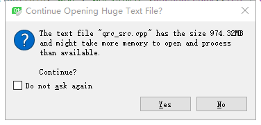
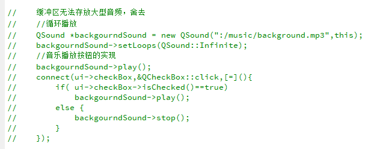
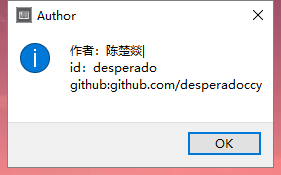
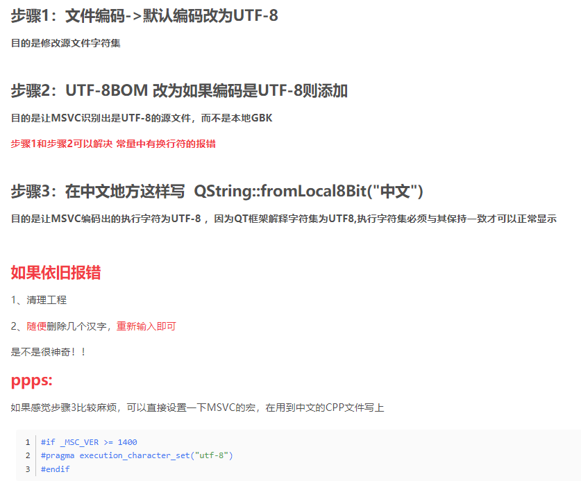

##开发QT桌面应用时遇到的问题

###一、堆溢出的问题

百思不得其解，由于是堆溢出的问题，第一个想到的是堆空间没有及时释放，即析构函数没有写好。然后去请教了一下曹师傅，曹师傅说堆溢出的原因就两个，一个是内存分配，一个是缓冲区问题。由于缓冲区不太明白是什么东西，所以自作主张认定是内存分配问题了。但是千改忘改都没有用，偶然之下，我移除了原本的背景音乐文件，结果就能跑了。

=_=......

---
缓冲区问题：

###二、中文问题

未解决

将“ ”中的中文改为英文就能跑了，原因未找到。

###三、sql数据库的链接问题

这个问题让我困扰了10个小时，百度了无数种方法，下载了各种包，都没有起效。结果问题就是因为QT不支持sql8.0!!!所以当qmysql驱动不能加载时，我将mysql8.0的libmysql.dll文件复制到编译器 bin 下是无用的！！！

---

解决方法：下载mysql5.7版本，并移植动态链接库到qt中，即可运行驱动。

###四、一个有趣小bug（中文）

编译器对中文的支持一直是让人头疼的问题，在开发过程中遇到每行最后一个汉字显示不出来的问题。

所以我只能把最后一个中文汉字转为中文|，这也就导致了这有两处非常突兀的竖线。

---
解决方案：将问题二和问题四结合起来思考，当我们在问题二里的字符串最后多敲一个空格，编译器不会报错，进而出现问题四（QAQ，无法复现bug）。如此一想，我们便可以想到中文编码的问题，中文在计算机中占两个字节，而程序出现了吞字现象，可能的原因只有编码冲突（Windows使用gbk，QT使用utf-8）。上网百度了一下方法。如图：

